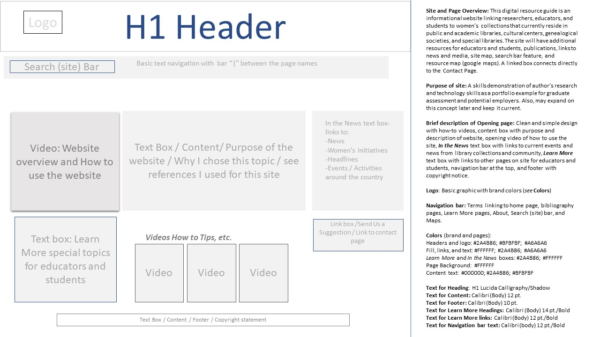
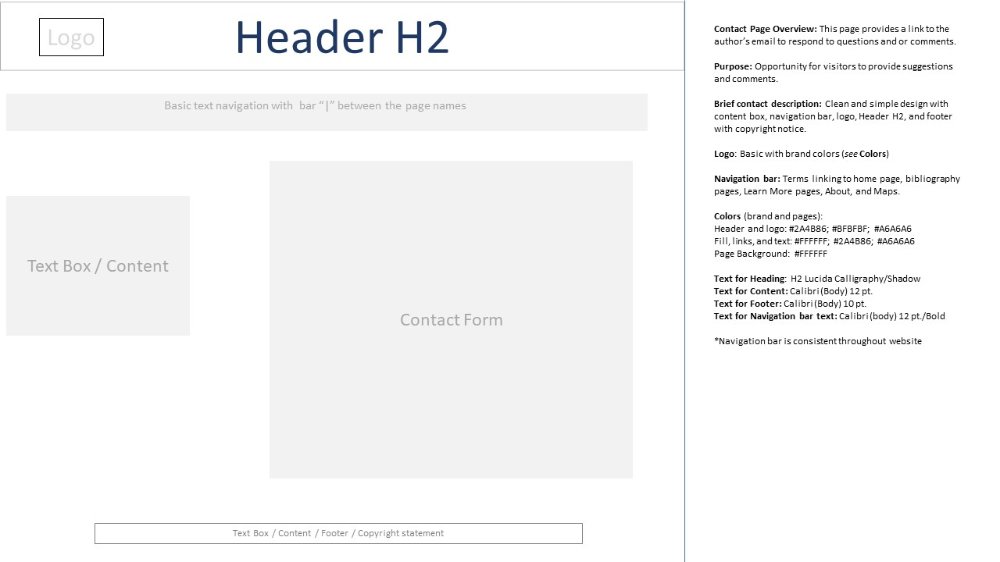
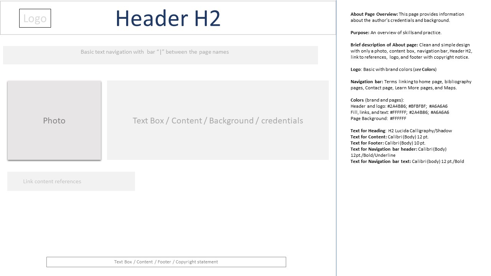

# INF6420 EastmanTalik Resource Guide 
This website Resource Guide will provide an example of my research skills for my portfolio. This digital resource guide is an informational website linking researchers, educators, and students to women’s collections that currently reside in public and academic libraries, cultural centers, genealogical societies, and special libraries. The site will have additional resources for educators and students, links to news and media, site map, and resource map (google maps). 

## Wireframes

The (3) wireframes included here will provide a brief overview of the site and structure. Each wireframe graphic has written details about the page on the right and a visual structure example on the left. The three wireframe examples below are: Opening page, Contact page, and About page. 

<b>Wireframe of "Opening" / landing page of the website</b> 

<b>Brief description of Opening page:</b> Clean and simple design with how-to videos, content box with purpose and description of website, opening video of how to use the site, In the News text box with links to current events and news from library collections and community, Learn More text box with links to other pages on site for educators and students. 

<b> Header (h1):</b> Digital Resources to Women's Collections 

<b>Navigation:</b> below the title with linked terms to bibliography pages, About, Contact, maps. Search (site) feature on the left of navigation.

<b>Main content:</b> Brief overview of why I decided on the topic, purpose of the site, what type of resources are available, how to find more information if it is not available on the site. Briefly discuss some features like the tips videos. Briefly discuss In the News links and Learn More information for students and educators. 

<b>Footer:</b> copyright notice.

<b>Wireframe of "Contact" page of the website</b> 

<b> Contact Page Overview:</b> This page provides a link to my email so that I can respond to questions, suggestions, or comments visitors may have about the site or content. 

<b>Header (h2):</b> Digital Resources to Women's Collections

<b>Navigation:</b> below the title with linked terms to opening page / landing page, bibliography pages, Learn More, About page, and maps. 

<b>Main content:</b> describe how to contact me using the form, and when to use the form for suggestions and comments. Describe what I may not be able to answer and provide information on where to find other resources for questions if needed. 

<b>Footer:</B> copyright notice.

<b>Wireframe of "About" page of the website</b> 

<b> About Page Overview:</b> The purpose of this page is to provide an overview of my skills and practice.

<b>Header (h2):</b> Digital Resources to Women's Collections

<b>Navigation:</b> below the title with linked terms to opening / landing page, bibliography pages, Learn More, Contact page, and maps. 

<b>Main content:</b> text content will provide a personal statement about my background and credentials. A graphic photo of me will display to the left of the content box. A link to additional information or publications is below the photo.

<b>Footer:</b> copyright notice.

